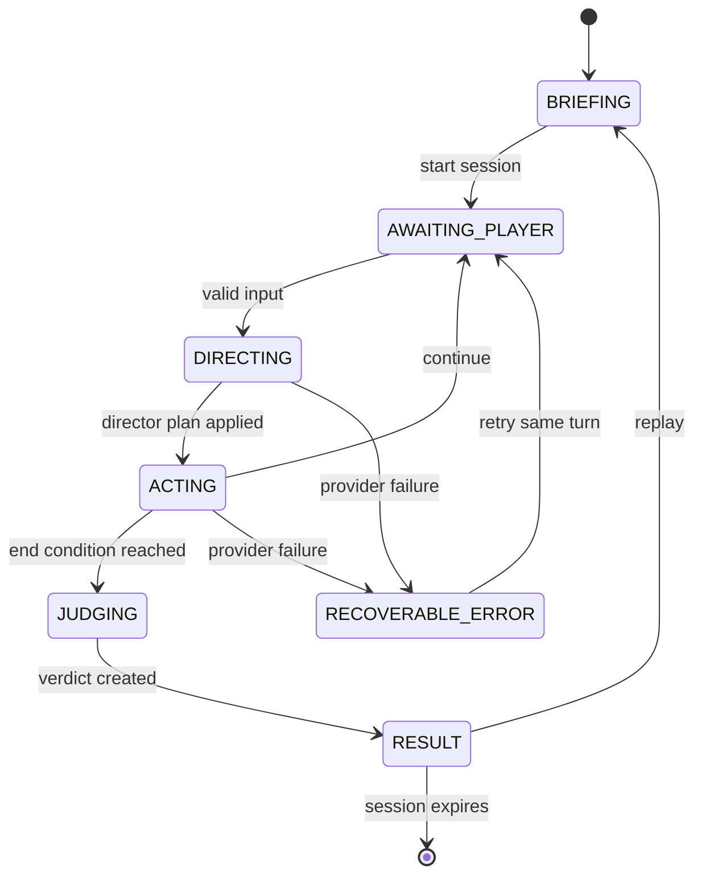

# 系统架构、状态机与开发计划

## 1. 仓库与部署决策

项目采用独立仓库和独立部署。

Carrick Games 的运行形态是静态页面 + Canvas 游戏类，当前发布包只包含 `index.html`、`dist/` 和字体。本项目的稳定运行依赖服务端 API Key、内存会话、模型编排、音频流代理、限流和供应商故障回退。独立仓库让安全边界、成本监控、发布节奏和回滚保持清晰。

集成方式：

1. 本项目通过 `https://games.carrick7.com/rel-arena/` 独立服务端运行。
2. Carrick Games 后续增加一个入口和封面卡。
3. 分享链接直接落到本项目的具体关卡。

Caddy 只把 `/rel-arena/*` 反向代理到 `127.0.0.1:3100`，其余路径继续由 Carrick Games 静态发布目录处理。应用通过 `APP_BASE_PATH=/rel-arena` 同时生成前端资源地址和服务端前缀兼容路由。

前端使用无依赖的 History API 路由，并由 Express/Vite SPA fallback 支持深链：

| 页面 | 路径 |
|---|---|
| 关卡目录 | `/rel-arena/` |
| 身份与场景简报 | `/rel-arena/scenarios/:scenarioId` |
| 对话 | `/rel-arena/sessions/:sessionId` |
| 结算 | `/rel-arena/sessions/:sessionId/result` |
| 已完成章节回忆 | `/rel-arena/scenarios/:scenarioId/memories` |

对话和结算深链通过 `GET /api/sessions/:sessionId` 恢复服务端 TTL 内的权威状态；会话过期时替换回关卡目录。结算 URL 替换对应的对话历史项，避免浏览器后退进入已经结束但无法继续输入的页面。页面 URL 不写入 `localStorage`。

## 2. 逻辑架构

```text
React Client
  ├─ Scenario Select / Briefing / Dialogue / Result
  ├─ Local progress + artifact index (no dialogue)
  ├─ Modality settings (text/voice/image/video)
  ├─ State-driven Portrait Renderer
  ├─ Speech input + TTS player
  ├─ Generated media renderer
  └─ Share adapter
          │ HTTPS JSON / audio / signed media URL
Express Orchestrator
  ├─ Session store (memory + TTL)
  ├─ Turn lock + rate limit
  ├─ Deterministic state reducer
  ├─ Director Agent
  ├─ Actor Agent
  ├─ Judge Agent
  ├─ Provider adapter
  │    ├─ Mock
  │    ├─ OpenAI Responses API
  │    └─ DeepSeek Chat Completions
  ├─ TTS adapter
  │    ├─ Xiaomi MiMo V2.5 TTS
  │    ├─ OpenAI TTS
  │    └─ Browser speech fallback
  ├─ Media adapter
  │    ├─ Mock
  │    └─ Ark Seedream / Seedance
  ├─ Usage ledger + pricing estimator
  ├─ Budget/error alerts + optional webhook
  └─ Server-issued visual beats + ending memory film
```

### 三 Agent 分工

**导演 Agent**

- 输入：场景圣经、当前权威状态、转录摘要、玩家本轮台词。
- 输出：局势评估、状态增量、剧情事件、下一拍角色指令、建议结束原因。
- 权限：提出状态变更和事件。
- 约束：服务端 reducer 执行数值截断和确定性结局门槛。

**角色 Agent**

- 输入：角色圣经、导演指令、更新后的状态、最近对话。
- 输出：台词、情绪、语气、表情、动作、状态变化说明。
- 权限：负责演出表现。
- 约束：台词长度、语言指纹、内容边界和枚举 Schema。

**评判 Agent**

- 输入：本关唯一目标、完整转录、最终状态、确定性结局 ID。
- 输出：结局文案、称号、评分、毒舌点评、目标判定、关键对话复盘、分享文案。
- 权限：负责解释和包装。
- 约束：结局 ID 与等级由确定性规则锁定。

每个 Agent 使用独立系统 Prompt。服务端一次玩家回合按“导演 → reducer → 角色 → 结束判定 → 评判”顺序执行。

## 3. 回合时序

```text
Client        API          Director       Reducer        Actor          Judge
  | submit     |              |              |              |              |
  |----------->| validate     |              |              |              |
  |            |------------->| evaluate     |              |              |
  |            |<-------------| plan         |              |              |
  |            |---------------------------->| clamp/apply   |              |
  |            |------------------------------------------->| perform      |
  |            |<-------------------------------------------| structured   |
  |            | finish?                                      |            |
  |            |---------------------------------------------------------->|
  |            |<----------------------------------------------------------|
  |<-----------| session + performance + optional result                    |
```

真实模型每轮产生两次串行文本调用，结算增加一次评判调用。Mock 保持完全相同的边界和数据结构。

## 4. 状态机



阶段枚举：

```ts
type GamePhase =
  | 'briefing'
  | 'awaiting_player'
  | 'directing'
  | 'acting'
  | 'judging'
  | 'result';
```

服务端响应只暴露稳定阶段。`directing`、`acting`、`judging` 主要用于内部追踪和未来 SSE 进度流。

## 5. 核心数据结构

```ts
interface GameState {
  sessionId: string;
  scenarioId: ScenarioId; // eight-value enum
  playerGender: 'male' | 'female';
  opponentGender: 'male' | 'female';
  phase: GamePhase;
  round: number;
  maxRounds: 5 | 6 | 7;
  metrics: {
    warmth: number;   // 关系温度 0..100，前端可见
    pressure: number; // 对话压力 0..100，前端可见
    openness: number; // 开放程度 0..100，仅供导演与结算
  };
  flags: {
    understoodNeed: boolean;
    proposedAction: boolean;
    respectedChoice: boolean;
    sincereCare: boolean;
  };
  activeEvent: StoryEvent | null;
  endingId: EndingId | null;
}

interface DirectorDecision {
  assessment: string;
  delta: MetricDelta;
  discoveries: StateFlags;
  event: StoryEvent | null;
  actorBrief: string;
  shouldEnd: boolean;
  suggestedEndReason: EndReason | null;
}

interface ActorPerformance {
  line: string;
  emotion: 'guarded' | 'angry' | 'hurt' | 'testing' | 'softening' | 'warm' | 'done';
  tone: 'icy' | 'sharp' | 'quiet' | 'shaky' | 'dry' | 'soft';
  expression: {
    brows: 'flat' | 'furrowed' | 'raised' | 'soft';
    eyes: 'direct' | 'averted' | 'narrowed' | 'wet' | 'soft';
    mouth: 'line' | 'smirk' | 'downturned' | 'parted' | 'small-smile';
  };
  action: {
    pose: ScenarioPose;
    gesture: ScenarioGesture;
    stageDirection: string;
  };
  stateChanges: MetricDelta;
}

interface JudgeVerdict {
  endingId: EndingId;
  tier: 'S' | 'A' | 'C';
  score: number;
  title: string;
  roast: string;
  epilogue: string;
  goal: GoalResult;
  keyMoments: KeyMoment[];
  shareText: string;
}
```

Zod Schema 同时承担 TypeScript 类型来源、API 运行时校验和 OpenAI JSON Schema 生成。

## 6. 确定性规则

- 所有关系数值限制在 `0..100`。
- 每回合关系温度变化限制在 `-18..16`，对话压力变化限制在 `-16..22`，开放程度变化限制在 `-12..16`。
- 每关定义独立初始数值、S/A 最早成功轮次和温度/压力门槛。
- S 需要理解需要、提出行动，并累计至少三类质量信号。
- A 需要至少两类质量信号，并包含具体行动或尊重选择。
- C 在关系温度 ≤ 8、对话压力 ≥ 94，或关卡轮次耗尽时锁定。
- 导演可建议提前结束，reducer 需要同时验证硬门槛。
- `GameStateSchema` 和 `PublicSessionSchema` 验证结局 ID 必须属于当前关卡。

## 7. API

| Method | Path | Purpose |
|---|---|---|
| GET | `/api/health` | 进程、Provider 与时间状态 |
| GET | `/api/capabilities` | 文本模型、TTS、语音输入提示 |
| GET | `/api/scenarios` | 获取八张关卡卡片的公开目录 |
| GET | `/api/scenarios/:scenarioId?playerGender=male\|female` | 获取指定关卡与身份的简报 |
| GET | `/api/scenario?playerGender=male\|female` | 旧客户端兼容，映射行李箱关 |
| POST | `/api/sessions` | 传入 `{ scenarioId, playerGender }` 创建新局；缺少 `scenarioId` 时兼容行李箱关 |
| GET | `/api/sessions/:id` | 恢复当前内存会话 |
| POST | `/api/sessions/:id/turns` | 提交玩家台词并完成一回合 |
| POST | `/api/speech` | 把角色台词转换为 AI 音频 |
| POST | `/api/media/access` | 校验页面媒体访问密钥，不返回供应商凭证 |
| POST | `/api/media/generations` | 从当前会话的服务端视觉节拍创建逐轮图像或结算回忆视频 |
| GET | `/api/media/generations/:id` | 查询当前进程内的媒体生成状态与结果 URL |
| GET | `/api/media/files/:filename` | 读取已复制到持久目录的不可猜测媒体制品 |
| GET | `/api/admin/usage` | 当日模型/TTS 聚合、阈值与最近告警 |
| GET | `/api/admin/metrics` | Prometheus 文本指标 |

会话使用 UUID，正文保存在进程内存，默认 120 分钟后过期。生产阶段可将会话存储替换为带 TTL 的 Redis。

用量日志采用 JSONL，只包含 UUID、Provider、模型、Agent、Token、缓存、延迟、重试、成功状态和成本估算，不包含 Prompt、台词或完整转录。默认写入 `var/usage-events.jsonl`；告警独立写入 `var/usage-alerts.jsonl`。服务启动时恢复最近 5,000 条技术事件和最近 50 条告警，使当日统计可跨进程重启。真实供应商返回的 Token 标记为 `provider_reported`，Mock 采用字符数近似并标记为 `estimated`。

浏览器使用 `relationship-training:progress:v1` 保存普通游戏进度：完成状态、分身份次数/最高分/最佳评级/已见结局、最近游玩时间和偏好身份；使用 `relationship-training:modalities:v1` 保存输入/输出模态；使用 `relationship-training:artifacts:v1` 保存已完成章节的匿名制品索引。该索引只包含关卡、身份、评级、完成时间、回合标签和稳定媒体 URL，不包含媒体访问密钥、会话 ID、对话正文、玩家输入或关系数值。

## 8. 模型与成本可行性

资料核对日期：2026-07-17。

### GPT 订阅

ChatGPT 订阅适合产品开发期间使用 Codex 和 ChatGPT。应用运行时使用 API Platform 的独立计费账户；ChatGPT 与 API 的账单和额度分别管理。[OpenAI 官方说明](https://help.openai.com/en/articles/8156019-is-api-usage-included-in-chatgpt-subscriptions-even-if-i-have-a-paid-chatgpt-account)

原型推荐：

- 文字：`gpt-5.4-mini`，当前公开价格为每百万输入 Token $0.75、输出 Token $4.50，支持 Structured Outputs。[模型页](https://developers.openai.com/api/docs/models/gpt-5.4-mini)
- 语音：默认使用小米 `mimo-v2.5-tts`，也可使用 `gpt-4o-mini-tts`；页面明确披露 AI 合成语音。[小米 MiMo TTS 指南](https://mimo.mi.com/docs/zh-CN/usage-guide/speech-synthesis) / [OpenAI TTS 指南](https://developers.openai.com/api/docs/guides/text-to-speech)
- 后续质量基准：用 GPT-5.6 Terra 与当前默认模型做固定轨迹评测。OpenAI 当前模型指南将 Terra 定位为质量与成本平衡档。[模型指南](https://developers.openai.com/api/docs/guides/latest-model)

按 7 轮、15 次文本调用、约 45K 输入 Token 与 3.4K 输出 Token 估算，`gpt-5.4-mini` 文本成本约 **$0.05/局**。语音成本单独统计，实际值以调用量和官方账单为准。

OpenAI Responses API 的用量读取 `usage.input_tokens`、`usage.input_tokens_details.cached_tokens`、可用时的 `cache_write_tokens`、`usage.output_tokens` 和推理明细。缓存写入 Token 按官方规则单独计价；切换不在内置价格表的模型时必须通过环境变量提供价格，系统会在价格缺失时显示“成本待定”，避免给出错误数字。

### DeepSeek API

DeepSeek API 提供 OpenAI 兼容的 Chat Completions 接口。2026-07-17 的公开模型是 `deepseek-v4-flash` 与 `deepseek-v4-pro`；`deepseek-chat` 和 `deepseek-reasoner` 计划于 2026-07-24 停用。[快速开始](https://api-docs.deepseek.com/)

`deepseek-v4-flash` 的当前公开价格为每百万缓存未命中输入 Token $0.14、输出 Token $0.28、缓存命中输入 Token $0.0028。[价格页](https://api-docs.deepseek.com/quick_start/pricing)

同一假设下，Flash 文本成本约 **$0.007/局**。它适合低成本内测和大量固定轨迹评测。JSON Output 偶尔会返回空内容，服务端已设计解析校验与一次重试；严格 Tool Schema 当前属于 Beta。[JSON Output 指南](https://api-docs.deepseek.com/guides/json_mode/)

DeepSeek 文本方案搭配小米 MiMo、OpenAI TTS 或浏览器系统语音。首版 Provider 选择建议：

1. 公开精品体验使用 DeepSeek/OpenAI 文本 + 小米 MiMo TTS。
2. 回归评测和成本压力测试使用 DeepSeek V4 Flash。
3. 每周对相同 30 条轨迹比较角色一致性、Schema 成功率、延迟和结局合理性。

`TTS_PROVIDER=auto` 的启动选择顺序为 MiMo → OpenAI → 浏览器。运行中服务端 TTS 出错时，角色文字先正常展示，客户端捕获音频错误并调用 Web Speech API，不阻塞对话回合。男女角色分别读取独立音色变量。

MiMo TTS 的 `audio` 对象没有独立语速参数，人物语速通过自然语言风格指令控制。所有情绪都要求保持自然日常对话速度；服务端音频在浏览器以 `1.08×` 播放，Web Speech 回退使用 `1.0×`（锋利语气为 `1.04×`），避免安静、迟疑等情绪被错误表现为拖慢语速。

内容链条按“文字 → 立绘 → 语音 → 图像/视频”逐层增强。文字状态机与字幕始终可运行；立绘随发布包提供；语音 Provider 缺失时回退浏览器；图像和视频由玩家显式选择，且仅在媒体 Provider 可用并通过产品访问密钥后生成。

### 火山方舟媒体生成边界

玩家触发的动态图像使用 Seedream，结算回忆视频使用 Seedance。`ARK_API_KEY` 只存在服务端；页面输入的 `MEDIA_ACCESS_KEY` 只承担产品门禁，不能替代供应商凭证。服务端为开场和每轮回复签发 `VisualBeat`，媒体接口只接受 `sessionId + beatId + kind`，拒绝客户端自定义 Prompt。图像允许引用该会话的任意有效节拍；视频只允许在结算后由最后一个节拍触发。相同会话、节拍和媒体类型幂等，媒体任务状态在进程内保存并随 TTL 过期。

每张图片固定传入秋雾两张状态原型和江影原型；存在上一张成功图片时一并作为连续性参考。图片 Prompt 使用本轮对话、表演动作、事件和关系状态理解情绪，同时明确禁止模型渲染文字；页面用真实对话 DOM 覆盖位图，避免乱码。结算视频选取开场、评判关键轮次和最后一轮的成功图片，连同人物原型作为最多九张 Seedance 参考图。

默认视频规格是 480p、16:9、15 秒、无生成音频和水印。生成任务采用异步创建与轮询，文字对话不等待媒体结果。媒体模型会临时接收生成所必需的对话上下文。Ark 成功结果会下载到 `MEDIA_ARCHIVE_DIR`（生产默认为 `/var/lib/carrick/relationship-arena/media`），因此制品跨原子发布与进程重启保留；Prompt 和对话正文仍不进入长期存储。

DeepSeek Chat Completions 的计量读取 `prompt_tokens`、`prompt_cache_hit_tokens`、`prompt_cache_miss_tokens`、`completion_tokens`、`reasoning_tokens` 和 `total_tokens`。缓存命中量按 DeepSeek 缓存单价计算。

## 9. 前后端技术选型

| 层 | 选择 | 原因 |
|---|---|---|
| 前端 | React 19 + TypeScript | 对话、状态动画、结果页和语音副作用具有清晰组件边界 |
| 构建 | Vite 8 | 开发服务器可作为 Express 中间件，生产生成静态资源 |
| 后端 | Node 22 + Express 5 | 单进程原型、原生 Fetch、音频代理和异步错误处理足够直接 |
| 校验 | Zod 4 | 类型、输入校验和 JSON Schema 共用一个定义 |
| 测试 | Vitest + Playwright | reducer 单测与完整交互路径分别覆盖 |
| 会话 | 进程内 Map + TTL | 原型零运维；生产替换 Redis |
| 立绘 | WebP + CSS Motion | 双角色、情绪状态切换、体积小；数据协议可接 Live2D |
| 音频 | MiMo/OpenAI TTS + Web Speech fallback | 真实 AI 声音与无 Key 演示路径同时成立 |
| 图像/视频 | Ark Seedream + Seedance | 多参考图人物锁定、逐轮图片、结算回忆视频与异步任务 |

## 10. 目录结构

```text
relationship-arena/
  docs/
    PRODUCT.md
    ARCHITECTURE.md
    PROMPTS.md
  src/
    client/
      components/
      App.tsx
      api.ts
      modalities.ts
      speech.ts
      styles.css
    server/
      providers/
        mock.ts
        remote.ts
        types.ts
      agents.ts
      engine.ts
      media.ts
      prompts.ts
      scenario.ts
      sessions.ts
      usage.ts
      index.ts
    shared/
      contracts.ts
  tests/
    game.spec.ts
  deploy/
    relationship-arena.service
    relationship-arena.env.example
    relationship-arena.caddy.example
  var/
    .gitkeep
  AGENTS.md
  .env.example
  index.html
  package.json
  playwright.config.ts
  tsconfig.json
  tsconfig.server.json
  vite.config.ts
  vitest.config.ts
```

## 11. 分阶段开发计划

### Phase 0：八关版本

- 完成八关目录、两种玩家身份、两位贯穿角色和每关三个结局。
- 完成关卡筛选、本机完成记录、分身份最佳成绩与结局收藏。
- 完成三 Agent 接口、Mock、OpenAI、DeepSeek Provider。
- 完成始终可用的文本输入与语音转写、可组合输出、AI TTS 和浏览器语音回退。
- 完成模态设置、Seedream 图像与 Seedance 视频输出、页面访问密钥门禁。
- 完成双角色动态立绘、状态 HUD、结算复盘和分享文本。
- 完成逐局与逐日用量统计、价格估算、JSONL、Prometheus 与四类阈值告警。
- 完成单元测试、生产构建与端到端测试。

### Phase 1：封闭试玩

- 建立 30～50 条固定对话轨迹评测集。
- 加入 SSE 阶段进度与台词流式展示。
- 建立匿名结局分布与 Prompt 版本指标，现有耗时、Token、重试和失败指标作为基线。
- 增加结果分享图与同局挑战链接。
- 部署 Redis TTL、IP 限流和成本熔断。

### Phase 2：内容生产工具

- 关卡 DSL、角色圣经编辑器、Prompt 版本管理。
- 自动跑轨迹并生成结局分布与角色漂移报告。
- 新增家庭冲突与朋友社交场景，每个场景先通过人工内容基准。
- 接入 Live2D adapter 和口型事件。

### Phase 3：主播与精品发布

- 观众投票模式、OBS 友好布局、二维码接话。
- 将当前进程内媒体任务升级为持久化异步队列，并增加并发与预算熔断。
- 结局收藏册、每日限制挑战和排行榜。
- 基于实测留存控制内容规模，维持小众精品节奏。

## 12. 主要风险与控制

| 风险 | 控制 |
|---|---|
| 两次串行模型调用造成等待 | 小模型、短输出、缓存稳定前缀、SSE 阶段反馈 |
| 模型擅自改状态或结局 | 确定性 reducer、Zod、数值 clamp、结局 ID 锁定 |
| 角色逐轮变成通用客服 | 角色语言指纹、固定轨迹评测 |
| 玩家提示注入 | 输入数据化、独立系统 Prompt、服务端权限边界 |
| 成本失控 | 最大 7 轮、输出上限、IP 限流、Provider 熔断、预算告警 |
| 对话涉及现实危机 | 安全分类、剧情暂停、明确虚构产品边界 |
| 语音合成延迟 | 文本先展示、音频异步、浏览器语音回退 |
| 图像/视频生成成本和延迟 | 产品访问密钥、逐轮幂等、单局单视频、低规格默认值、异步展示与接口限流 |
