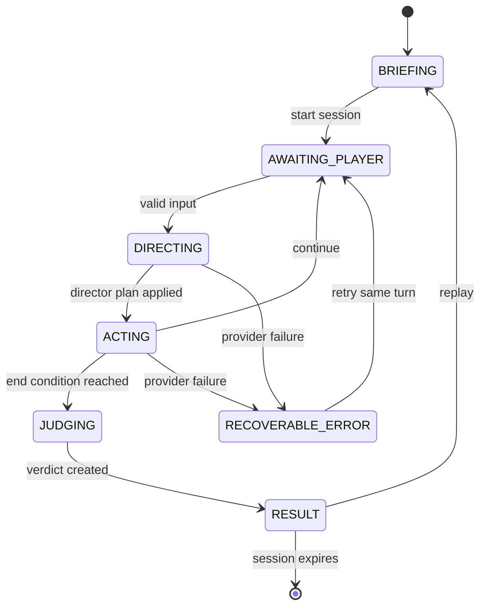

# 系统架构、状态机与开发计划

## 1. 仓库与部署决策

项目采用独立仓库和独立部署。

Carrick Games 的运行形态是静态页面 + Canvas 游戏类，当前发布包只包含 `index.html`、`dist/` 和字体。本项目的稳定运行依赖服务端 API Key、内存会话、模型编排、音频流代理、限流和供应商故障回退。独立仓库让安全边界、成本监控、发布节奏和回滚保持清晰。

集成方式：

1. 本项目独立域名部署，例如 `arena.carrick7.com`。
2. Carrick Games 增加一个外链入口和封面卡。
3. 分享链接直接落到本项目的具体关卡。

## 2. 逻辑架构

```text
React Client
  ├─ Briefing / Dialogue / Result
  ├─ SVG Portrait Renderer
  ├─ Speech input + TTS player
  └─ Share adapter
          │ HTTPS JSON / audio
Express Orchestrator
  ├─ Session store (memory + TTL)
  ├─ Turn lock + rate limit
  ├─ Deterministic state reducer
  ├─ Director Agent
  ├─ Actor Agent
  ├─ Judge Agent
  ├─ Provider adapter
  │    ├─ Mock
  │    ├─ OpenAI Responses API
  │    └─ DeepSeek Chat Completions
  ├─ OpenAI TTS adapter
  └─ Video hook adapter (reserved)
```

### 三 Agent 分工

**导演 Agent**

- 输入：场景圣经、当前权威状态、转录摘要、玩家本轮台词。
- 输出：局势评估、状态增量、禁令判断、剧情事件、下一拍角色指令、建议结束原因。
- 权限：提出状态变更和事件。
- 约束：服务端 reducer 执行禁词检测、数值截断和确定性结局门槛。

**角色 Agent**

- 输入：角色圣经、导演指令、更新后的状态、最近对话。
- 输出：台词、情绪、语气、表情、动作、状态变化说明。
- 权限：负责演出表现。
- 约束：台词长度、语言指纹、内容边界和枚举 Schema。

**评判 Agent**

- 输入：公开目标、隐藏目标、限制、完整转录、最终状态、确定性结局 ID。
- 输出：结局文案、称号、评分、毒舌点评、目标判定、关键对话复盘、分享文案。
- 权限：负责解释和包装。
- 约束：结局 ID 与等级由确定性规则锁定。

每个 Agent 使用独立系统 Prompt。服务端一次玩家回合按“导演 → reducer → 角色 → 结束判定 → 评判”顺序执行。

## 3. 回合时序

```text
Client        API          Director       Reducer        Actor          Judge
  | submit     |              |              |              |              |
  |----------->| validate     |              |              |              |
  |            |------------->| evaluate     |              |              |
  |            |<-------------| plan         |              |              |
  |            |---------------------------->| clamp/apply   |              |
  |            |------------------------------------------->| perform      |
  |            |<-------------------------------------------| structured   |
  |            | finish?                                      |            |
  |            |---------------------------------------------------------->|
  |            |<----------------------------------------------------------|
  |<-----------| session + performance + optional result                    |
```

真实模型每轮产生两次串行文本调用，结算增加一次评判调用。Mock 保持完全相同的边界和数据结构。

## 4. 状态机



阶段枚举：

```ts
type GamePhase =
  | 'briefing'
  | 'awaiting_player'
  | 'directing'
  | 'acting'
  | 'judging'
  | 'result';
```

服务端响应只暴露稳定阶段。`directing`、`acting`、`judging` 主要用于内部追踪和未来 SSE 进度流。

## 5. 核心数据结构

```ts
interface GameState {
  sessionId: string;
  scenarioId: 'suitcase-at-one';
  phase: GamePhase;
  round: number;
  maxRounds: 7;
  metrics: {
    trust: number;          // 0..100
    anger: number;          // 0..100
    vulnerability: number;  // 0..100
    hiddenProgress: number; // 0..3
  };
  flags: {
    forbiddenPhraseCount: number;
    namedSpecificHurt: boolean;
    ownedChoice: boolean;
    concretePlan: boolean;
    relationshipChosen: boolean;
  };
  activeEvent: StoryEvent | null;
  endingId: EndingId | null;
}

interface DirectorDecision {
  assessment: string;
  delta: MetricDelta;
  discoveries: StateFlags;
  restrictionHit: boolean;
  event: StoryEvent | null;
  actorBrief: string;
  shouldEnd: boolean;
  suggestedEndReason: EndReason | null;
}

interface ActorPerformance {
  line: string;
  emotion: 'guarded' | 'angry' | 'hurt' | 'testing' | 'softening' | 'warm' | 'done';
  tone: 'icy' | 'sharp' | 'quiet' | 'shaky' | 'dry' | 'soft';
  expression: {
    brows: 'flat' | 'furrowed' | 'raised' | 'soft';
    eyes: 'direct' | 'averted' | 'narrowed' | 'wet' | 'soft';
    mouth: 'line' | 'smirk' | 'downturned' | 'parted' | 'small-smile';
  };
  action: {
    pose: 'arms-crossed' | 'holding-handle' | 'turned-away' | 'leaning' | 'relaxed';
    gesture: 'none' | 'points-door' | 'checks-phone' | 'releases-handle' | 'wipes-eye';
    stageDirection: string;
  };
  stateChanges: MetricDelta;
}

interface JudgeVerdict {
  endingId: EndingId;
  tier: 'S' | 'A' | 'C' | 'F';
  score: number;
  title: string;
  roast: string;
  epilogue: string;
  goals: GoalResults;
  keyMoments: KeyMoment[];
  shareText: string;
}
```

Zod Schema 同时承担 TypeScript 类型来源、API 运行时校验和 OpenAI JSON Schema 生成。

## 6. 确定性规则

- 所有数值限制在 `0..100`，隐藏进度限制在 `0..3`。
- 服务端词表检测禁词，模型判断作为补充信号。
- 每回合信任变化限制在 `-18..16`，愤怒变化限制在 `-16..22`。
- S 结局门槛：第 4 轮起，信任 ≥ 72、愤怒 ≤ 28、隐藏进度 = 3、禁词次数 = 0。
- A 结局门槛：第 5 轮起，信任 ≥ 54、愤怒 ≤ 52、具体行动成立。
- F 特殊结局：禁词次数 ≥ 2，或禁词触发且最终信任 < 35。
- C 结局：信任 ≤ 10、愤怒 ≥ 90，或第 7 轮结束仍未满足更高结局。
- 导演可建议提前结束，reducer 需要同时验证硬门槛。

## 7. API

| Method | Path | Purpose |
|---|---|---|
| GET | `/api/health` | 进程、Provider 与时间状态 |
| GET | `/api/capabilities` | 文本模型、TTS、语音输入提示 |
| GET | `/api/scenario` | 获取当前关卡简报 |
| POST | `/api/sessions` | 创建新局并返回关卡简报与开场演出 |
| GET | `/api/sessions/:id` | 恢复当前内存会话 |
| POST | `/api/sessions/:id/turns` | 提交玩家台词并完成一回合 |
| POST | `/api/speech` | 把角色台词转换为 AI 音频 |

会话使用 UUID，正文保存在进程内存，默认 120 分钟后过期。生产阶段可将会话存储替换为带 TTL 的 Redis。

## 8. 模型与成本可行性

资料核对日期：2026-07-17。

### GPT 订阅

ChatGPT 订阅适合产品开发期间使用 Codex 和 ChatGPT。应用运行时使用 API Platform 的独立计费账户；ChatGPT 与 API 的账单和额度分别管理。[OpenAI 官方说明](https://help.openai.com/en/articles/8156019-is-api-usage-included-in-chatgpt-subscriptions-even-if-i-have-a-paid-chatgpt-account)

原型推荐：

- 文字：`gpt-5.4-mini`，当前公开价格为每百万输入 Token $0.75、输出 Token $4.50，支持 Structured Outputs。[模型页](https://developers.openai.com/api/docs/models/gpt-5.4-mini)
- 语音：`gpt-4o-mini-tts`，支持中文、流式音频和语气指令，页面需要披露 AI 合成语音。[TTS 指南](https://developers.openai.com/api/docs/guides/text-to-speech)
- 后续质量基准：用 GPT-5.6 Terra 与当前默认模型做固定轨迹评测。OpenAI 当前模型指南将 Terra 定位为质量与成本平衡档。[模型指南](https://developers.openai.com/api/docs/guides/latest-model)

按 7 轮、15 次文本调用、约 45K 输入 Token 与 3.4K 输出 Token 估算，`gpt-5.4-mini` 文本成本约 **$0.05/局**。语音成本单独统计，实际值以调用量和官方账单为准。

### DeepSeek API

DeepSeek API 提供 OpenAI 兼容的 Chat Completions 接口。2026-07-17 的公开模型是 `deepseek-v4-flash` 与 `deepseek-v4-pro`；`deepseek-chat` 和 `deepseek-reasoner` 计划于 2026-07-24 停用。[快速开始](https://api-docs.deepseek.com/)

`deepseek-v4-flash` 的当前公开价格为每百万缓存未命中输入 Token $0.14、输出 Token $0.28、缓存命中输入 Token $0.0028。[价格页](https://api-docs.deepseek.com/quick_start/pricing)

同一假设下，Flash 文本成本约 **$0.007/局**。它适合低成本内测和大量固定轨迹评测。JSON Output 偶尔会返回空内容，服务端已设计解析校验与一次重试；严格 Tool Schema 当前属于 Beta。[JSON Output 指南](https://api-docs.deepseek.com/guides/json_mode/)

DeepSeek 文本方案搭配浏览器系统语音或 OpenAI TTS。首版 Provider 选择建议：

1. 公开精品体验使用 OpenAI 文本 + OpenAI TTS。
2. 回归评测和成本压力测试使用 DeepSeek V4 Flash。
3. 每周对相同 30 条轨迹比较角色一致性、Schema 成功率、延迟和结局合理性。

## 9. 前后端技术选型

| 层 | 选择 | 原因 |
|---|---|---|
| 前端 | React 19 + TypeScript | 对话、状态动画、结果页和语音副作用具有清晰组件边界 |
| 构建 | Vite 8 | 开发服务器可作为 Express 中间件，生产生成静态资源 |
| 后端 | Node 22 + Express 5 | 单进程原型、原生 Fetch、音频代理和异步错误处理足够直接 |
| 校验 | Zod 4 | 类型、输入校验和 JSON Schema 共用一个定义 |
| 测试 | Vitest + Playwright | reducer 单测与完整交互路径分别覆盖 |
| 会话 | 进程内 Map + TTL | 原型零运维；生产替换 Redis |
| 立绘 | SVG + CSS Motion | 情绪驱动、体积小、可测试；数据协议可接 Live2D |
| 音频 | OpenAI TTS + Web Speech fallback | 真实 AI 声音与无 Key 演示路径同时成立 |

## 10. 目录结构

```text
relationship-arena/
  docs/
    PRODUCT.md
    ARCHITECTURE.md
    PROMPTS.md
  src/
    client/
      components/
      App.tsx
      api.ts
      speech.ts
      styles.css
    server/
      providers/
        mock.ts
        remote.ts
        types.ts
      agents.ts
      engine.ts
      prompts.ts
      scenario.ts
      sessions.ts
      index.ts
    shared/
      contracts.ts
  tests/
    game.spec.ts
  AGENTS.md
  .env.example
  index.html
  package.json
  playwright.config.ts
  tsconfig.json
  tsconfig.server.json
  vite.config.ts
  vitest.config.ts
```

## 11. 分阶段开发计划

### Phase 0：本次原型

- 完成单场景、单角色、四结局。
- 完成三 Agent 接口、Mock、OpenAI、DeepSeek Provider。
- 完成文本输入、可选语音输入、AI TTS、浏览器语音回退。
- 完成 SVG 动态立绘、状态 HUD、结算复盘和分享文本。
- 完成单元测试、生产构建与端到端测试。

### Phase 1：封闭试玩

- 建立 30～50 条固定对话轨迹评测集。
- 加入 SSE 阶段进度与台词流式展示。
- 记录匿名耗时、Token、结局、重试和解析失败指标。
- 增加结果分享图与同局挑战链接。
- 部署 Redis TTL、IP 限流和成本熔断。

### Phase 2：内容生产工具

- 关卡 DSL、角色圣经编辑器、Prompt 版本管理。
- 自动跑轨迹并生成结局分布、角色漂移和禁词漏检报告。
- 新增家庭冲突与朋友社交场景，每个场景先通过人工内容基准。
- 接入 Live2D adapter 和口型事件。

### Phase 3：主播与精品发布

- 观众投票模式、OBS 友好布局、二维码接话。
- 开场、关键转折、结局视频 Hook 接入异步生成队列。
- 结局收藏册、每日限制挑战和排行榜。
- 基于实测留存控制内容规模，维持小众精品节奏。

## 12. 主要风险与控制

| 风险 | 控制 |
|---|---|
| 两次串行模型调用造成等待 | 小模型、短输出、缓存稳定前缀、SSE 阶段反馈 |
| 模型擅自改状态或结局 | 确定性 reducer、Zod、数值 clamp、结局 ID 锁定 |
| 角色逐轮变成通用客服 | 角色语言指纹、禁用表达、固定轨迹评测 |
| 玩家提示注入 | 输入数据化、独立系统 Prompt、服务端权限边界 |
| 成本失控 | 最大 7 轮、输出上限、IP 限流、Provider 熔断、预算告警 |
| 对话涉及现实危机 | 安全分类、剧情暂停、明确虚构产品边界 |
| 语音合成延迟 | 文本先展示、音频异步、浏览器语音回退 |
